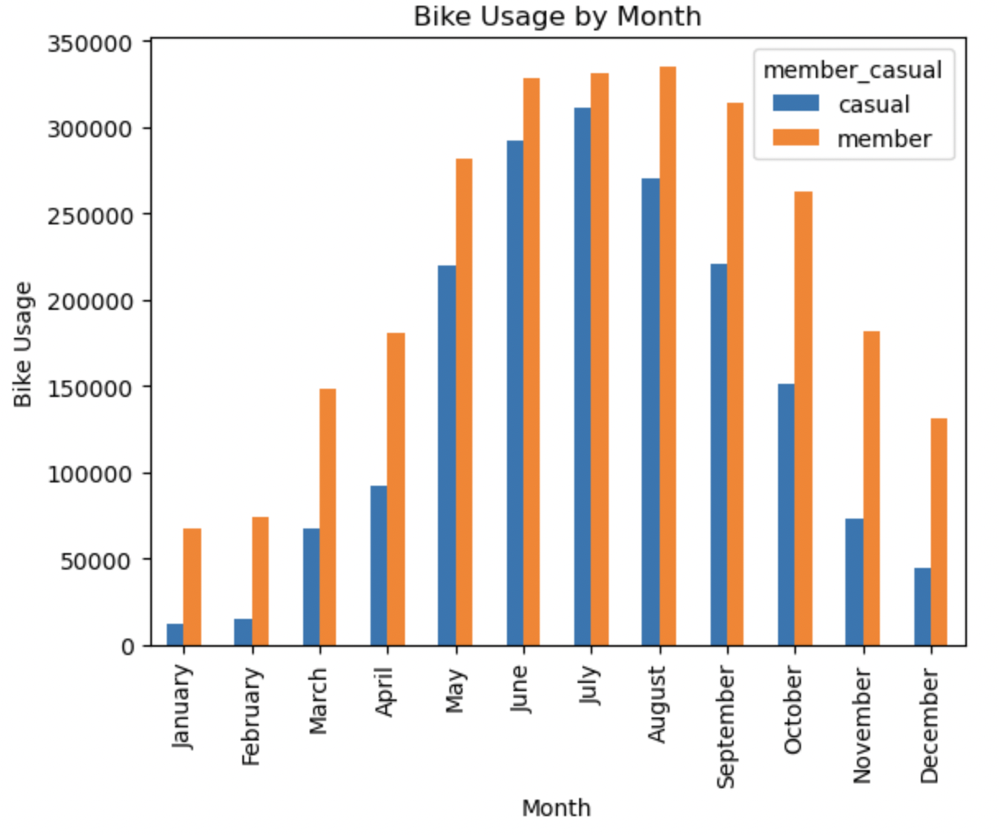

# cyclistic_analysis
This is a part of the Google Professional Certificate for Data Analytics capstone project, to perform analysis for a fictional bike-share company Cyclistic.

Technologies used for the project:
* Microsoft Excel for initial review the data.
* Python and Jupyter notebook/lab for data processing and cleaning.
* Python and Jupyter notebook/lab for exploratory data analysis and visualizations.
* Microsoft Word for documenting data-cleaning process; and summary report.
* Tableau Public for visualizations and presentation.

## Tableau Story Page of This Analysis
[Cyclistic Analysis Tableau Page](https://public.tableau.com/views/Cyclistic_Analysis_16719916661720/HowDoCasualRidersandAnnualMembersUseCyclisticdifferently?:language=en-US&:display_count=n&:origin=viz_share_link)

# Project Overview
This project is the capstone project for Google Professional Certificate for Data Analytics. Cyclistic is a fictional bike-sharing based in Chicago, the director of marketing believes the future success depends on maximizing the number of annual members and would like to find out how annual members and casual riders use the services differently.

In this project, I'm trying to discover insights, relationships and create visualizations for the results, and make a summary and suggestions based on the results of the analysis.

# Results  
### Annual Members vs Casual Riders

From this result, we can see that annual members have about 1/3 more usage than casual users.   

### Type of Bikes Used by Riders

This result shows that classic bikes are the most used type of bike by both annual members and casual users, electric bikes are second, and from our data, there are no data of annual members using docked bikes, which is something we should further investigate to find out if the docked bike was not available for annual members or there are errors when gathering the data.

### Average Trip Duration

Annual members mostly use the service for commuting, they have an average of 12 mins of trip duration. Whereas casual riders use the service more for leisure, so they have a longer trip duration, about 24 mins.

### Hourly Usage of the Service

Annual members have peaks of usage around 7-8 am and 4-6 pm, which are typical commuting hours. Casual riders' usage increases as the day go and a peak around 5-6 pm. From this result, late afternoon/early evening have higher usage by both kinds of users.

### Daily Usage of the Service

Annual members have higher usage during the week, whereas casual riders use the service more on the weekends.

### Monthly Usage of the Service

Based on this result, the service's peak seasons are spring to fall. The weather in Chicago during the winter can be difficult for users to use the service. Due to the lower rate of usage, late fall/early winter can be a good time if the company needs to perform annual maintenance. During the off-season, annual members' rate of usage for the service is significantly higher than casual riders.

# Summary
**Annual members**
* They use the service more for daily commute purposes.
* They tend to have a higher frequency of usage but have shorter average trip duration.
* On average, they have peaked around 7-8 am and 4-6 pm, which are typical commuting hours.
* Since they use the service more for the daily commute, they tend to use the service more during the week.
* During the off-season, there is significantly higher usage for annual members than casual riders.

**Casual Riders**
* They use the service more for leisure purposes.
* They tend to have a higher average trip duration.
* Their usage during the day will increase as the day goes, and have a peak around 5-6 pm.
* They have higher rates of usage during weekends.
* They have very low usage during off-seasons.

## Suggestion
* Since late afternoon/early evening have a higher rate of usage, we can have premium rates for these hours for casual users.
* Casual users have longer average trip duration, so maybe charging by time of using the service could be a good way to give them a reason to sign up for annual membership. The charging can be premium rates for the first 10 mins, the second 10 mins will have a lower rate, and so on.
* Spring to fall are the peak seasons for both types of users to use the service, so I'd suggest that to do annual maintenance during the off-season which is winter.
* Seasonal promotion for peak seasons and off seasons.
* Social media is a powerful tool and platform for marketing, we can encourage members to use hashtags and share how the Cyclistic bikes helped them or have an impact to their lives.
